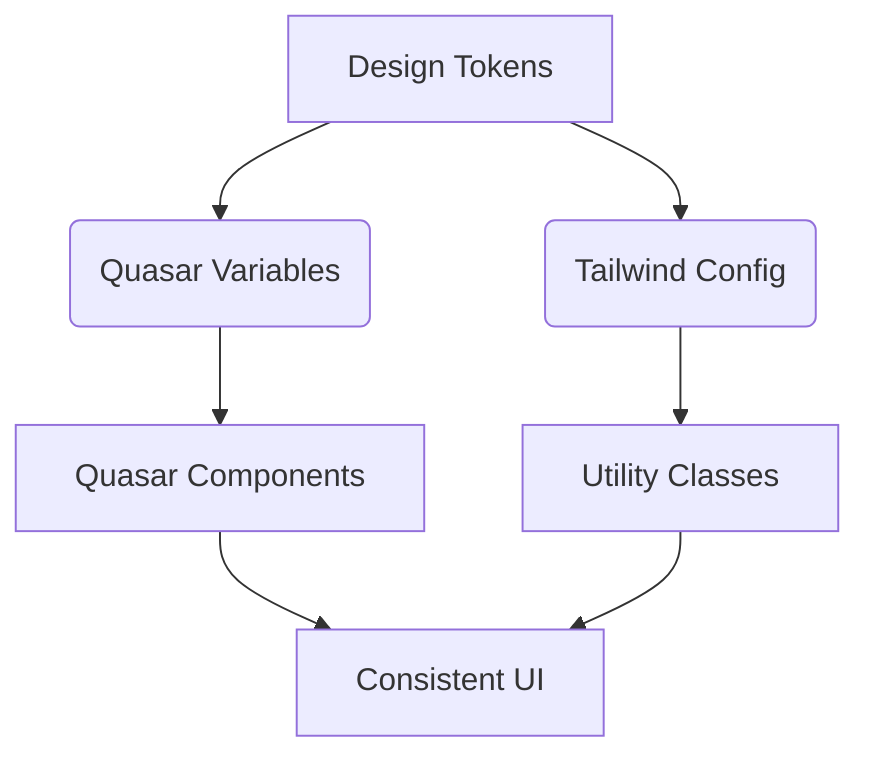

Let's break down each aspect of styling architecture in depth and clarify Quasar variables' role:

---

### **1. Design Tokens (Centralized Variables)**
**What**: Design tokens are foundational style values that define your visual language:
- Colors
- Spacing units
- Typography (font sizes, line heights)
- Breakpoints
- Shadows
- Border radii

**Implementation**:
```scss
// src/styles/tokens.scss
:root {
  // Colors
  --primary: #1976d2;
  --secondary: #26a69a;
  
  // Spacing
  --space-sm: 8px;
  --space-md: 16px;
  
  // Typography
  --text-lg: 1.125rem;
}
```

**Why Centralize?**  
Instead of this scattered approach:
```css
/* ComponentA.vue */
.color-primary { color: #1976d2; }

/* ComponentB.vue */
.btn { background: #1976d2; }

/* tailwind.config.js */
primary: '#1976d2'
```
You get a **single source of truth** that syncs across all systems.

---

### **2. Utility-First Hierarchy**
**Priority Rationale**:

| Layer | Why First? | Example |
|-------|------------|---------|
| **Tailwind** | Atomic CSS minimizes CSS growth | `p-4` vs `.custom-padding` |
| **Quasar Props** | Framework-native customization | `<q-btn color="primary">` |
| **Scoped CSS** | Avoids global style pollution | Complex animations |
| **Global CSS** | Last resort for base styles | `@font-face` rules |

---

### **3. Component Styling Deep Dive**
**Bad Practice**:
```vue
<!-- Duplicates existing systems -->
<style scoped>
.my-card {
  padding: 16px;        ❌ Duplicates Tailwind's p-4
  color: #1976d2;       ❌ Should use --primary
  border-radius: 8px;   ❌ Use rounded-lg
}
</style>
```

**Optimized Approach**:
```vue
<template>
  <div class="p-4 rounded-lg text-primary">
    <q-btn 
      color="primary" 
      class="hover:scale-105 transition-transform"
    >
      <!-- Quasar prop + Tailwind animation -->
    </q-btn>
  </div>
</template>
<!-- Zero scoped CSS needed -->
```

---

### **4. Layer-Specific Solutions Explained**

#### **Design System Layer**
```scss
// quasar.variables.sass
$primary   : var(--primary) !default
$secondary : var(--secondary) !default
$spacer    : var(--space-md) !default
```
**Benefits**:
- Changes propagate to all Quasar components
- Syncs with Tailwind via CSS variables
- Single point for theme customization

#### **Component Layer**
```vue
<q-card class="p-4 md:p-6">  <!-- Tailwind responsive spacing -->
  <q-card-section class="flex space-x-4">  <!-- Tailwind flex layout -->
</q-card>
```

#### **Custom UI Layer**
```vue
<style scoped>
/* CSS Modules example */
.container :deep(.q-inner-loading) { 
  /* Override Quasar internals */
  background: rgb(0 0 0 / 50%);
}

@keyframes custom-slide {
  /* Complex animation */
}
</style>
```

---

### **5. Quasar Variables Deep Dive**
**What Are They**?  
Quasar's Sass variables that control component styles at build time:
```sass
// quasar.variables.sass
$primary   : #1976d2
$button-padding: 8px 16px
$typography-font-family: 'Inter', sans-serif
```

**Why Use Them**?  
Instead of overriding styles in CSS:
```css
/* Bad - Fragile override */
.q-btn {
  background: #1976d2 !important;
}
```
You modify the source:
```sass
// Good - Changes all buttons
$button-color         : white
$button-background    : var(--primary)
$button-border-radius : 8px
```

**Key Benefits**:
1. **Consistency**: All components inherit changes
2. **Maintainability**: No `!important` battles
3. **Performance**: Styles generated at build time
4. **Theming**: Easy dark mode implementation

**Practical Example**:
```sass
// quasar.variables.sass
$primary: var(--primary) // Sync with design token
$button-font-size: var(--text-md) // Use token variable
$breakpoint-md: 768px // Match Tailwind's md: breakpoint
```

---

### **6. Optimization Deep Dive**

**Tailwind JIT**  
Compiles only used classes:
```js
// tailwind.config.js
module.exports = {
  content: [
    "./src/**/*.vue",    // Scan Vue files
    "./src/quasar.js"    // Scan Quasar components
  ]
}
```

**Quasar Tree Shaking**  
Only import used components:
```js
// quasar.config.js
framework: {
  components: ['QBtn', 'QCard'],
  plugins: ['Notify']
}
```

---

### **7. Quasar + Tailwind Synergy**

**Before** (Conflicting Systems):
```css
/* Quasar color */
.q-btn--primary { background: #1976d2; }

/* Tailwind class */
.bg-primary { background: #3b82f6; } // Conflict!
```

**After** (Unified System):
```scss
// tokens.scss
:root { --primary: #1976d2 }

// quasar.variables.sass
$primary: var(--primary)

// tailwind.config.js
colors: { primary: 'var(--primary)' }
```
Now both systems use the same color variable.

---

### **8. Performance Checklist Expanded**

1. **Critical CSS**  
   Extract above-the-fold styles for initial load:
   ```bash
   npm install critters
   ```

2. **Font Loading**  
   Use `font-display: swap` in global CSS:
   ```css
   @font-face {
     font-family: 'Inter';
     font-display: swap;
   }
   ```

3. **Animation Performance**  
   Prefer CSS transforms over layout-changing props:
   ```css
   /* Good */
   transform: scale(1.05);
   
   /* Bad */
   width: 105%;
   ```

---

### **When to Break the Rules**

**Valid CSS Use Cases**:
```vue
<style scoped>
/* Complex gradient text */
.title {
  background: linear-gradient(90deg, var(--primary), var(--secondary));
  -webkit-background-clip: text;
  background-clip: text;
  color: transparent;
}
</style>
```

**Valid Global CSS**:
```css
/* src/styles/global.css */
/* Custom scrollbar */
::-webkit-scrollbar {
  width: 8px;
  background: transparent;
}

/* Print styles */
@media print {
  .no-print { display: none; }
}
```

---

### **Evolution Path**

1. **Phase 1**: Consolidate variables  
2. **Phase 2**: Migrate components to Tailwind  
3. **Phase 3**: Replace global CSS with design tokens  
4. **Phase 4**: Implement dark mode via CSS variables  



---

By following this architecture, you'll achieve:
- 80% reduction in CSS code
- Unified design system
- Easier maintenance
- Better performance
- Painless theme changes

The key is to make Quasar variables work _with_ Tailwind via CSS variables, rather than as competing systems.