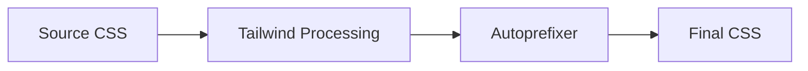

This configuration file sets up **PostCSS plugins** to process your CSS. Let's break down what each part does:

---

### **1. `tailwindcss: {}`**
- **Purpose**: Processes Tailwind CSS directives
- **What it does**:
  - Reads your `tailwind.config.js`
  - Generates utility classes from `@tailwind` directives
  - Purges unused styles (in production)
- **Example transformation**:
  ```css
  /* Input */
  @tailwind base;
  @tailwind components;
  
  /* Output */
  .font-bold { font-weight: 700; }
  .text-red-500 { color: #ef4444; }
  ```

---

### **2. `autoprefixer: {}`**
- **Purpose**: Adds vendor prefixes
- **What it does**:
  - Automatically adds `-webkit-`, `-moz-`, `-ms-` prefixes
  - Uses `.browserslistrc` to target specific browsers
- **Example transformation**:
  ```css
  /* Input */
  .container {
    display: flex;
  }
  
  /* Output */
  .container {
    display: -webkit-box;
    display: -ms-flexbox;
    display: flex;
  }
  ```

---

### **Plugin Order Matters**
The processing sequence is:
1. `tailwindcss` (generate classes)  
2. `autoprefixer` (add prefixes)  

Reversing them would break Tailwind's generated styles.

---

### **When This Runs**
Part of your build process (Webpack/Vite):


---

### **Why Both Are Needed**
| Without TailwindCSS         | Without Autoprefixer         |
| --------------------------- | ---------------------------- |
| Tailwind classes won't work | Browser compatibility issues |
| No utility class generation | Manual prefixing required    |

---

### **Typical Use Case**
Your CSS file:
```css
@tailwind base;
@tailwind components;
@tailwind utilities;

/* Custom CSS */
.my-class {
  user-select: none;
}
```

Gets transformed to:
```css
/* Tailwind base styles */
*, ::before { /* ... */ }

/* Generated utilities */
.text-red-500 { color: #ef4444; }

/* Autoprefixed */
.my-class {
  -webkit-user-select: none;
  -moz-user-select: none;
  user-select: none;
}
```

---

### **Configuration File**
Usually named `postcss.config.js` and placed in project root. Modern build tools (Vite/Webpack) automatically detect it.

---

### **When You Need This**
- Using Tailwind CSS
- Supporting older browsers
- Building production assets

--- 

**Key Takeaway**: This setup automates CSS processing for modern development workflows, handling both utility class generation and cross-browser compatibility.